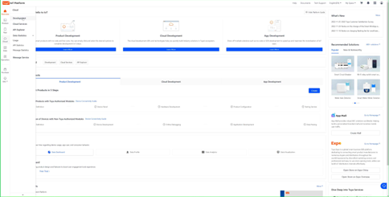
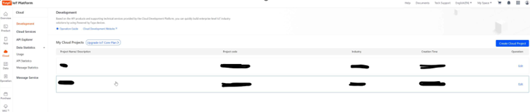
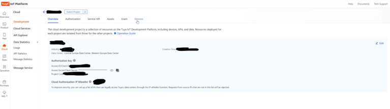
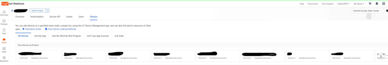
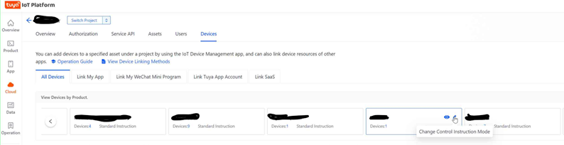
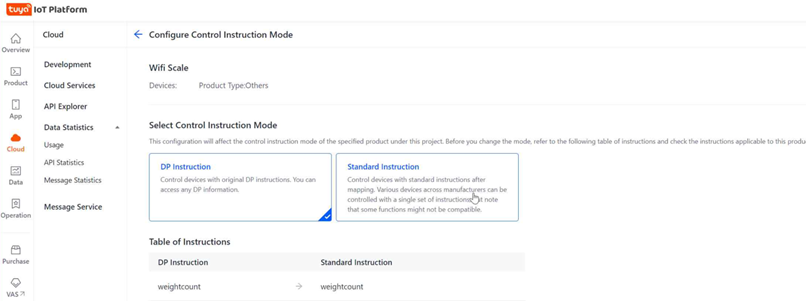
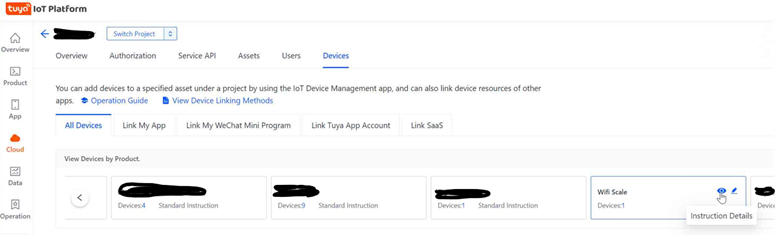
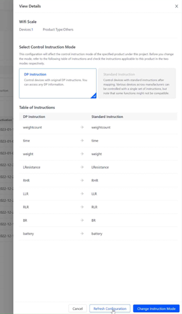
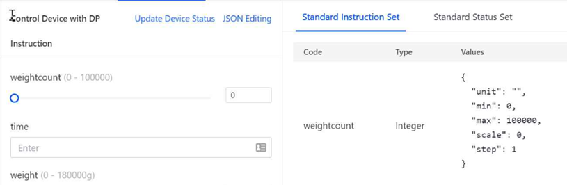
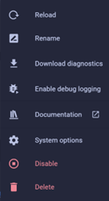

# How to add support for unsupported Tuya devices

## Tuya Developer Portal

- Login to Developer Portal
- Open *Cloud* menu and click on *Development*

  

- Open the relevant project from the list

  

- In the upper navigation menu, click on *Devices*

  

- From the product navigation menu (*View devices by product*) find the relevant product you would like to add support

  

- Click on the *Change control instruction mode*

  

- Select *DP Instructions* instead of *Standard instructions*

  

- List of supported DP codes with their names will appear
- Click on *Save configuration* button
- You will get redirected to the device list again
- Find (again) the product ou have changed in the product navigation menu
- Click on *Instruction details* button next the name

  

- On the right side will be opened *Details view* on the right side

  

- Click on *Refresh configuration* button
- Close the *Details view*
- Click on *Debug device* link related to one of the devices of the product
- DP Instructions should appear in new format, if not, refresh the screen using F5

  

## Home Assistant

- In HA, Open Settings -> Device & Services
- Find Tuya integration
- Click on the 3 dots menu and then on the reload menu item

  

- Once reloaded message appeared, open the menu again and this time click on Download diagnostics
- In the downloaded file, you should find the additional JSON related to the device (functions and status list)
- If the support for the device already added, you will see also the entities within the device
- If no support available yet, please report in GitHub to add support with the JSON of the device
